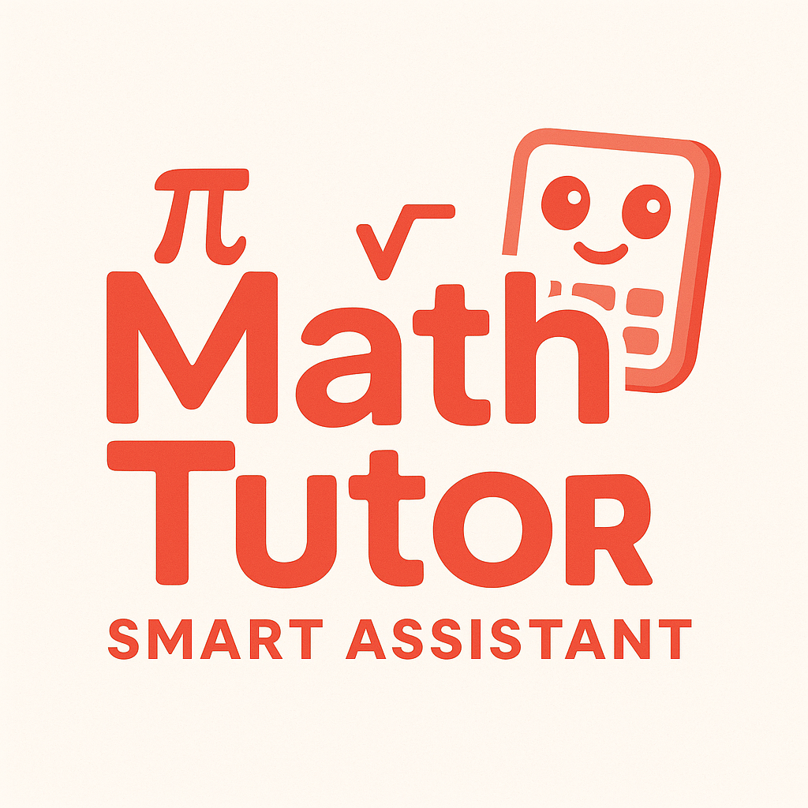
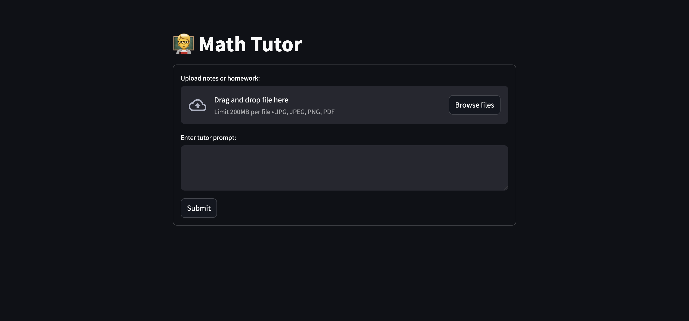

# Math Tutor Smart Assistant

## Overview 
A Python/LangChain project that allows users to upload notes and receive math tutoring.

## Tech Stack
- **Frontend** Streamlit
- **LLM Framework** LangChain
    - **Model** GPT-4o
- **Image Processing** Pillow

## Functionality
- Create a profile in the *settings* page. 
- Upload jpg, jpeg, and pdf files, prompt ChatGPT for personalized tutoring.
- (In-Progress) Receive practice problems based on user data.

## Requirements
- OpenAI API Key
